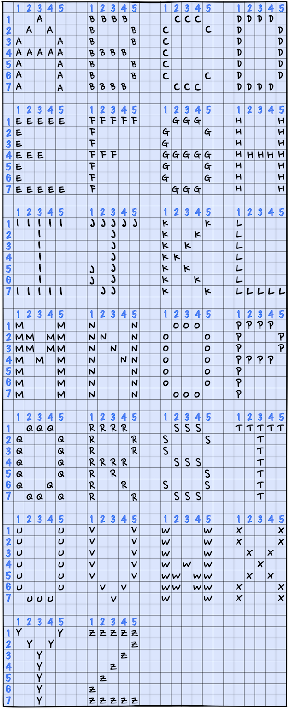
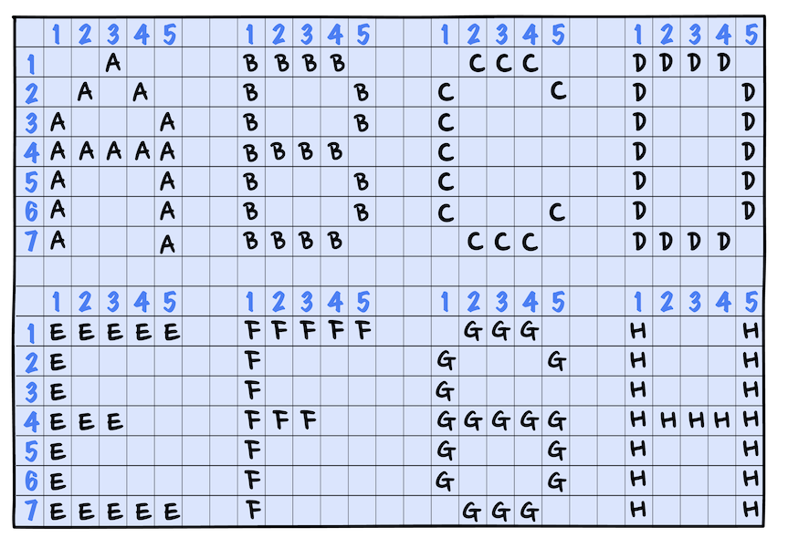
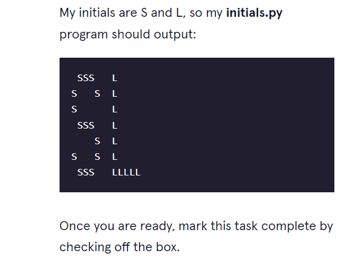
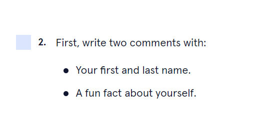

# consider this image

# reademe
ASCII art is a graphic design technique that uses computers for presentation and consists of pictures pieced together from individual characters.

Write a Python program called initials.py that displays the initials of your name in block letters as shown and dip your toes into ASCII art.

Happy Coding!

# 1) first task to check
  
# 2) second task to check
  

 

