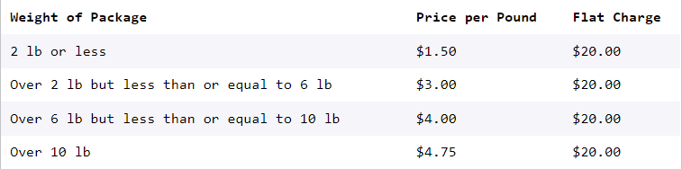
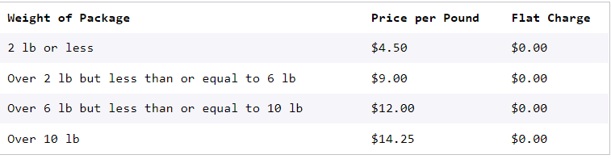

# Sal's Shipping

# give the star on gitub
Sal runs the biggest shipping company in the tri-county area, Sal’s Shippers. Sal wants to make sure that every single one of his customers has the best, and most affordable experience shipping their packages.

In this project, you’ll build a program that will take the weight of a package and determine the cheapest way to ship that package using Sal’s Shippers.

Sal’s Shippers has several different options for a customer to ship their package:

* Ground Shipping, which is a small flat charge plus a rate based on the weight of your package.
* Ground Shipping Premium, which is a much higher flat charge, but you aren’t charged for weight.
* Drone Shipping (new), which has no flat charge, but the rate based on weight is triple the rate of ground shipping.

Here are the prices:

Ground Shipping

Ground Shipping Premium

Flat charge: $125.00

Drone Shipping

Write a shipping.py Python program that asks the user for the weight of their package and then tells them which method of shipping is cheapest and how much it will cost to ship their package using Sal’s Shippers.

Note that the walkthrough video for this project is slightly out of date — the walkthrough was done using a version of this project that uses functions. Feel free to come back to the video after having been introduced to functions!